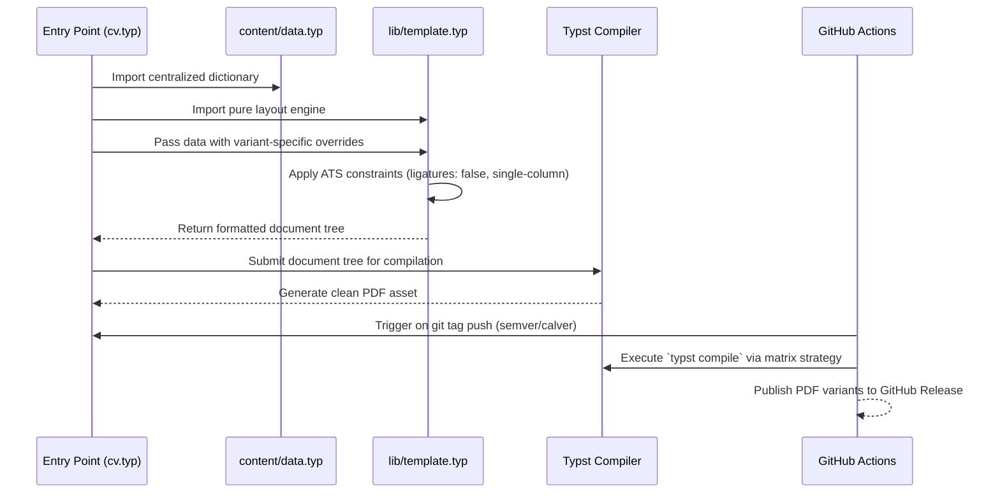

# DOCUMENT_CONTROL_AND_METADATA
- **Target Release Version**: v1.0.0-alpha
- **Upstream Reference**: `specs/001-typst-cv-migration/explore.md`, `specs/001-typst-cv-migration/design.md`, `specs/001-typst-cv-migration/data-model.md`
- **Downstream Epic Tracker**: `specs/001-typst-cv-migration`
- **Status**: PROPOSED

# SYSTEM_OBJECTIVES_AND_SCOPE_BOUNDARY
## Core Value Proposition
Migrate the existing LaTeX-based CV repository to a Typst-based system, eliminating all LaTeX artifacts while enforcing strict data/presentation separation, ATS compatibility, and bi-variant resume/cover letter generation via a modernized GitHub Actions CI/CD pipeline.
## In-Scope Boundaries (Hard Directives)
- Implementation of `content/data.typ` as the centralized data dictionary.
- Implementation of `lib/template.typ` as the pure layout engine enforcing ATS compatibility (`ligatures: false`, single-column).
- Creation of variant entry points: `cv.typ`, `cv_embedded.typ`, `cv_enterprise.typ`, and `cover_letter.typ`.
- Migration of `.github/workflows/release.yml` to use `typst-community/setup-typst@v5` with a matrix strategy.
- Complete removal of all `.tex`, `.cls`, LaTeX-specific Dockerfiles, and VS Code LaTeX configurations.
## Out-of-Scope Boundaries (Defensive Exclusions)
- Migration or maintenance of `written_interview.tex` (deferred to user decision).
- Migration of `analysis/` directory files or `amazon-lp-cheatsheet-draft.md` (unrelated to CV output).
- External JSON/YAML data serialization (rejected in favor of native Typst dictionaries).

# ARCHITECTURAL_CONSTRAINTS_AND_PREREQUISITES
## Data Models & Invariants
```typst
#let cv_data = (
  name: "Werner Bisschoff",
  email: "werner@example.com",
  phone: "+27 00 000 0000",
  location: "Cape Town, South Africa",
  position: "Systems Engineer",
  summary: [Software engineer with 5+ years of experience...],
  experience: experience_entries,
  education: education_entries,
  projects: project_entries,
  skills: skill_categories,
  ai_policy: [I treat AI as an agentic partner within a strict engineering framework...],
  job_target: [Seeking a mid to senior software engineering role...],
)
```
- **Invariant**: `position` must strictly match bi-variant targets. `experience` and `education` arrays must contain ≥1 entry.
## Performance / Scalability Thresholds
- Compilation time must remain under 2 seconds per variant on GitHub Actions Ubuntu runners.
- PDF output must be clean, single-column, and free of complex tables or color fills to ensure ATS parsing compatibility.
## Security & Compliance Invariants
- No external network calls during compilation.
- All fonts must be explicitly loaded via `#set text(font: "...")` using Typst-native equivalents or vendored files to ensure deterministic rendering.

# FUNCTIONAL_FLOW_AND_SEQUENCE_ARCHITECTURE
## System Orchestration Mapping


# FUNCTIONAL_REQUIREMENTS_AND_EPICS
## FR-001-DATA: Centralized Data Dictionary
- **Description**: Define a single source of truth for all professional experience, education, skills, and personal information using native Typst dictionaries.
- **Preconditions**: `content/` directory exists.
- **Inputs/Outputs**: Input: Raw text data. Output: `content/data.typ` with strictly typed dictionary structures.
- **State Transition**: `STATE_DRAFT` ➔ `STATE_VALIDATED` ➔ `STATE_MERGED`
- **Exception Strategy**: Missing required keys must be caught by validation helpers in `lib/template.typ` before rendering.
- **Acceptance Criteria (Definition of Done)**:
  1. `[AC-001-DATA-01]`:
     - **Given**: `content/data.typ` is created with the `cv_data` dictionary.
     - **When**: `typst check content/data.typ` is executed.
     - **Then**: The command exits with code 0, confirming syntactic validity.
  2. `[AC-001-DATA-02]`:
     - **Given**: The `experience` array in `content/data.typ`.
     - **When**: The file is evaluated.
     - **Then**: It contains at least one entry with `role`, `company`, `location`, `start_date`, and `description` keys.
- **Downstream Shard Mapping**: Epic Issue `#001`

## FR-002-LAYOUT: Pure Layout Engine
- **Description**: Implement `lib/template.typ` as a pure function module that accepts data dictionaries and applies ATS-compatible formatting without containing any content data.
- **Preconditions**: `lib/` directory exists. `content/data.typ` is defined.
- **Inputs/Outputs**: Input: Data dictionary. Output: Formatted Typst document tree.
- **State Transition**: `STATE_EMPTY` ➔ `STATE_CONFIGURED` ➔ `STATE_RENDERED`
- **Exception Strategy**: Over-abstracting layout into generic conditionals is prohibited; variant-specific logic must remain in entry points.
- **Acceptance Criteria (Definition of Done)**:
  1. `[AC-002-LAYOUT-01]`:
     - **Given**: `lib/template.typ` is implemented.
     - **When**: `typst fmt --check lib/template.typ` is executed.
     - **Then**: The command exits with code 0, confirming consistent code style.
  2. `[AC-002-LAYOUT-02]`:
     - **Given**: The layout engine is invoked.
     - **When**: It processes any data dictionary.
     - **Then**: It enforces `#set text(ligatures: false)` and single-column page margins globally.
- **Downstream Shard Mapping**: Epic Issue `#001`

## FR-003-ENTRY: Variant Entry Point Orchestration
- **Description**: Create distinct root files (`cv.typ`, `cv_embedded.typ`, `cv_enterprise.typ`, `cover_letter.typ`) that import data and layout modules, applying variant-specific overrides before compilation.
- **Preconditions**: `content/data.typ` and `lib/template.typ` are implemented.
- **Inputs/Outputs**: Input: Variant identifier. Output: Complete Typst document ready for compilation.
- **State Transition**: `STATE_DRAFT` ➔ `STATE_VARIANT_SELECTED` ➔ `STATE_READY`
- **Exception Strategy**: If an entry point fails to compile, the GitHub Actions matrix must fail fast without silently skipping other variants.
- **Acceptance Criteria (Definition of Done)**:
  1. `[AC-003-ENTRY-01]`:
     - **Given**: `cv_embedded.typ` exists.
     - **When**: `typst compile cv_embedded.typ cv_embedded.pdf` is executed.
     - **Then**: A valid PDF is generated with the position set to "Embedded Systems & Real-Time Software Engineer".
  2. `[AC-003-ENTRY-02]`:
     - **Given**: All four entry points exist.
     - **When**: `typst check` is run on each.
     - **Then**: All exit with code 0, confirming no missing dictionary keys or syntax errors.
- **Downstream Shard Mapping**: Epic Issue `#001`

## FR-004-CI: GitHub Actions Pipeline Migration
- **Description**: Replace the existing LaTeX-based CI pipeline with a Typst-native pipeline using `typst-community/setup-typst@v5` and a matrix strategy for variant compilation.
- **Preconditions**: All `.typ` entry points are functional locally.
- **Inputs/Outputs**: Input: Git tag push (semver `v*` or calver `YYYY.MM*`). Output: GitHub Release with attached PDF assets.
- **State Transition**: `STATE_IDLE` ➔ `STATE_BUILDING` ➔ `STATE_RELEASED`
- **Exception Strategy**: Missing custom fonts on the Ubuntu runner must be mitigated by explicit installation steps or bundling.
- **Acceptance Criteria (Definition of Done)**:
  1. `[AC-004-CI-01]`:
     - **Given**: A new git tag matching `v*` is pushed.
     - **When**: The `.github/workflows/release.yml` pipeline triggers.
     - **Then**: It uses `typst-community/setup-typst@v5` and successfully compiles all defined variants via a matrix strategy.
  2. `[AC-004-CI-02]`:
     - **Given**: The compilation step completes successfully.
     - **When**: The workflow reaches the release step.
     - **Then**: All generated PDF variants are attached to the GitHub Release using `softprops/action-gh-release@v2`.
- **Downstream Shard Mapping**: Epic Issue `#001`

## FR-005-CLEANUP: LaTeX Artifact Removal
- **Description**: Systematically remove all legacy LaTeX files, vendored classes, Docker build scripts, and VS Code LaTeX configurations to prevent build confusion and scope creep.
- **Preconditions**: Typst system is fully functional and CI is passing.
- **Inputs/Outputs**: Input: Legacy file list. Output: Clean repository state.
- **State Transition**: `STATE_LEGACY` ➔ `STATE_REMOVED` ➔ `STATE_VERIFIED`
- **Exception Strategy**: Advisory files (`analysis/`, `amazon-lp-cheatsheet-draft.md`) must be explicitly flagged for user decision before deletion, not auto-removed.
- **Acceptance Criteria (Definition of Done)**:
  1. `[AC-005-CLEANUP-01]`:
     - **Given**: The migration is complete.
     - **When**: `find . -name "*.tex" -o -name "*.cls"` is executed.
     - **Then**: No LaTeX source or class files remain in the repository (excluding `example/` if retained for reference, but ideally removed).
  2. `[AC-005-CLEANUP-02]`:
     - **Given**: The repository is cleaned.
     - **When**: `.gitignore` is updated.
     - **Then**: It excludes Typst cache/build artifacts (e.g., `.typst/`, `*.pdf` if not tracked, though PDFs are release artifacts).
- **Downstream Shard Mapping**: Epic Issue `#001`

# NON_FUNCTIONAL_ENGINEERING_REQUIREMENTS
- **Observability & Telemetry**: GitHub Actions workflow logs must clearly indicate which variant failed if a matrix job fails.
- **Reliability & Fallbacks**: CI matrix strategy ensures that a failure in one variant's compilation does not silently skip the others.
- **Type Safety & Modularity**: `typst check` must pass on all `.typ` files. `typst fmt --check` must pass to ensure consistent code style.

# GITHUB_ISSUE_SHARDING_STRATEGY
## Shard Mechanics
Each FR module boundary is mapped to a single, self-contained GitHub Issue. The Issue will contain the FR description, all associated ACs in Gherkin format, and the specific file paths to be created/modified. This preserves data and context encapsulation.
## Dependency Topology Graph
```text
FR-001-DATA (content/data.typ)
       │
       ├─► FR-002-LAYOUT (lib/template.typ)
       │        │
       │        └─► FR-003-ENTRY (cv*.typ, cover_letter.typ)
       │                 │
       │                 └─► FR-004-CI (.github/workflows/release.yml)
       │                          │
       └──────────────────────────┴─► FR-005-CLEANUP (Remove *.tex, *.cls, docker/)
```
## Issue Template Protocol
- **Title**: `[FR-XXX] <Module Name>`
- **Body**: Must include the exact Gherkin ACs, file paths (relative to repo root), and constitutional constraints (e.g., "Must enforce `ligatures: false`").

# AMBIGUITY_RESOLUTION_AND_STAKEHOLDER_DECISIONS
- `[RESOLVED_Q_01]`: Data Serialization Format ➔ **Resolution Requirement Invariant**: Native Typst dictionaries will be used instead of JSON/YAML to satisfy Data/Presentation Separation without violating simplicity mandates or introducing external build dependencies.
- `[RESOLVED_Q_02]`: Font Management ➔ **Resolution Requirement Invariant**: Custom fonts will be explicitly loaded via `#set text(font: "...")` using Typst-native equivalents or vendored files to ensure deterministic rendering across local and CI environments.

## [DECISION_READINESS]
- [x] Requirements space clear of technical blindspots
- [x] Interface data type contracts completely defined
- [x] Constitutional exceptions isolated and closed
[Blocking_Decisions]: None. Ready for issue sharding.

## [CLARIFICATION_LOG]
- `[Q_01]`: Should `written_interview.tex` and `analysis/` files be migrated or deleted? — [Status]: RESOLVED — [Impact]: Excluded from scope (FR-005-CLEANUP) and flagged for explicit user decision to prevent accidental data loss.

# SESSION_STATE
```json
{
  "current_focus": "PRD compilation for 001-typst-cv-migration",
  "resolved_questions": [
    "Data serialization format (Native Typst Dict)",
    "Font management strategy (Explicit loading/vendoring)",
    "Scope of non-CV artifacts (Excluded, flagged for user decision)"
  ],
  "pending_unknowns": []
}
```

# SOURCE_REGISTRY
| ID | Type | Source / Path (Strictly Relative to Repo Root) | Relevance Note |
| :--- | :--- | :--- | :--- |
| SRC-001 | Spec_Discovery | `specs/001-typst-cv-migration/explore.md` | Source exploration tracking framework parameters. |
| SRC-002 | Spec_Design | `specs/001-typst-cv-migration/design.md` | Architectural decisions and options matrix. |
| SRC-003 | Spec_DataModel | `specs/001-typst-cv-migration/data-model.md` | Entity definitions and schema tables. |
| SRC-004 | Constitution | `specs/constitution.md` | Bootstrapped architectural constraints and testing mandates. |