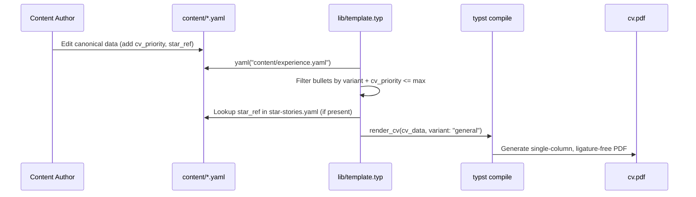

# DOCUMENT_CONTROL_AND_METADATA
- **Target Release Version**: v1.0.0-alpha
- **Upstream Reference**: `specs/002-yaml-content-layer/explore.md`
- **Downstream Epic Tracker**: `specs/issues.jsonl` (Epic 002)
- **Status**: PROPOSED

# SYSTEM_OBJECTIVES_AND_SCOPE_BOUNDARY
## Core Value Proposition
Replace the dual-sourced, hardcoded Typst data dictionary (`content/data.typ`) and markdown master list (`content/master-list.md`) with a single, canonical YAML-based content layer (`content/*.yaml`). This enables unified consumption by both the Typst CV generation pipeline (filtered by variant and priority) and the future Astro website (unconstrained rendering), while introducing explicit curation metadata (`cv_priority`, `website_show`, `star_ref`).

## In-Scope Boundaries (Hard Directives)
- Creation of 6 canonical YAML files: `config.yaml`, `experience.yaml`, `star-stories.yaml`, `skills.yaml`, `projects.yaml`, `education.yaml`.
- Refactoring `content/data.typ` into a thin YAML-import adapter layer using Typst's built-in `yaml()` function.
- Updating `lib/template.typ` to consume the new YAML-derived data structure while preserving the existing `render_cv(cv_data, variant: "...")` entry point signature.
- Implementation of defensive `.at(key, default: ...)` access patterns to prevent runtime crashes from missing YAML keys.
- Deletion of `content/master-list.md` upon successful verification of the new YAML layer.

## Out-of-Scope Boundaries (Defensive Exclusions)
- Astro website integration implementation (deferred to future epic; architecture only guarantees compatibility).
- External YAML preprocessing scripts or build-step transformations (violates constitutional deterministic build mandate).
- Automated YAML-to-Typst schema validation tooling (mitigated via manual `validate.typ` assertions and `yamllint` CI step).

# ARCHITECTURAL_CONSTRAINTS_AND_PREREQUISITES
## Data Models & Invariants
All YAML files must strictly adhere to the following structural invariants (derived from `specs/002-yaml-content-layer/data-model.md`):
- `cv_priority` must be an integer ∈ {1, 2, 3}.
- `website_show` must be a boolean.
- `star_ref` must be a string matching an existing `StarStory.id` or `null`.
- YAML `null` values must be explicitly handled via Typst `.at(key, default: none)` to avoid silent resolution to empty strings.

## Performance / Scalability Thresholds
- Typst compilation time must not increase by more than 15% compared to the baseline `content/data.typ` implementation.
- YAML file sizes must remain under 500 lines total to prevent merge conflict fatigue and maintain readability.

## Security & Compliance Invariants
- **Deterministic Builds**: Zero external network calls during compilation. All YAML files must be resolved via local file system paths relative to the calling Typst file.
- **No External Packages**: Must use Typst's built-in `yaml()` function. The non-existent `@preview/yaml` package is strictly forbidden.

# FUNCTIONAL_FLOW_AND_SEQUENCE_ARCHITECTURE
## System Orchestration Mapping


# FUNCTIONAL_REQUIREMENTS_AND_EPICS
## FR-001-YAML-DATA-LAYER: Canonical YAML Data Creation
- **Description**: Migrate all hardcoded data from `content/data.typ` and `content/master-list.md` into 6 distinct, canonical YAML files with explicit curation metadata.
- **Preconditions**: `content/data.typ` and `content/master-list.md` exist and contain the current source of truth.
- **Inputs/Outputs**: Input: Existing Typst dictionaries and markdown lists. Output: `config.yaml`, `experience.yaml`, `star-stories.yaml`, `skills.yaml`, `projects.yaml`, `education.yaml`.
- **State Transition**: `LEGACY_HARDCODED` ➔ `MIGRATION_IN_PROGRESS` ➔ `CANONICAL_YAML_ESTABLISHED`
- **Exception Strategy**: If a bullet lacks a clear `cv_priority`, default to `3` (website only) to prevent CV bloat, requiring manual review.
- **Acceptance Criteria (Definition of Done)**:
  1. `[AC-001-01]`:
     - **Given**: The legacy `content/data.typ` and `content/master-list.md` files exist.
     - **When**: The migration script or manual process completes.
     - **Then**: All 6 YAML files exist in `content/` and contain 100% of the legacy data, with every experience bullet tagged with `cv_priority` and `website_show`.
  2. `[AC-001-02]`:
     - **Given**: The new `content/experience.yaml` file.
     - **When**: A YAML linter (e.g., `yamllint`) is executed against it.
     - **Then**: The file passes all syntax and structural validation rules without errors.
- **Downstream Shard Mapping**: Epic 002, Issue #1

## FR-002-TYPST-ADAPTER: Typst YAML Import Layer
- **Description**: Replace the 298-line hardcoded `content/data.typ` with a thin adapter layer that imports the canonical YAML files and re-exports them in a shape compatible with `lib/template.typ`.
- **Preconditions**: The 6 canonical YAML files exist and are valid.
- **Inputs/Outputs**: Input: `content/*.yaml` files. Output: `cv_data` dictionary exported by `content/data.typ`.
- **State Transition**: `HARDCODED_EXPORT` ➔ `YAML_IMPORT_ADAPTER`
- **Exception Strategy**: Use `.at(key, default: ...)` for all nested YAML access to prevent runtime crashes if a key is misspelled or omitted in the YAML file.
- **Acceptance Criteria (Definition of Done)**:
  1. `[AC-002-01]`:
     - **Given**: The new `content/data.typ` adapter layer is implemented.
     - **When**: `typst compile cv.typ W_Bisschoff_CV.pdf` is executed.
     - **Then**: The compilation succeeds without runtime errors, and the output PDF visually matches the baseline generated from the legacy `data.typ`.
  2. `[AC-002-02]`:
     - **Given**: A variant entry point (e.g., `cv_systems.typ`).
     - **When**: `typst compile cv_systems.typ W_Bisschoff_CV_systems.pdf` is executed.
     - **Then**: The compilation succeeds, and the output correctly filters experience bullets based on `variant: "systems"` and `cv_priority <= 2`.
- **Downstream Shard Mapping**: Epic 002, Issue #2

## FR-003-TEMPLATE-ALIGNMENT: Template Engine Compatibility
- **Description**: Ensure `lib/template.typ` correctly consumes the YAML-derived data structure without requiring a complete rewrite of the rendering logic.
- **Preconditions**: `FR-002-TYPST-ADAPTER` is complete and exporting `cv_data`.
- **Inputs/Outputs**: Input: `cv_data` from `content/data.typ`. Output: Rendered Typst document elements.
- **State Transition**: `LEGACY_CONSUMPTION` ➔ `YAML_COMPATIBLE_CONSUMPTION`
- **Exception Strategy**: If the YAML structure diverges significantly from the legacy Typst dictionary shape, implement a transformation function within `content/data.typ` to normalize the output before it reaches `lib/template.typ`.
- **Acceptance Criteria (Definition of Done)**:
  1. `[AC-003-01]`:
     - **Given**: The `lib/template.typ` file.
     - **When**: `typst fmt --check` is executed.
     - **Then**: The file passes formatting checks, and no legacy hardcoded data references remain.
  2. `[AC-003-02]`:
     - **Given**: An experience bullet with a valid `star_ref`.
     - **When**: The template renders the experience section.
     - **Then**: The template successfully resolves the `star_ref` and appends the corresponding STAR story details (or gracefully degrades if the reference is `null`).
- **Downstream Shard Mapping**: Epic 002, Issue #3

## FR-004-LEGACY-CLEANUP: Artifact Removal and Verification
- **Description**: Remove superseded legacy files and ensure the CI/CD pipeline validates the new architecture.
- **Preconditions**: `FR-001`, `FR-002`, and `FR-003` are complete and visually verified.
- **Inputs/Outputs**: Input: Legacy files. Output: Clean repository state, updated CI pipeline.
- **State Transition**: `LEGACY_PRESENT` ➔ `LEGACY_REMOVED`
- **Exception Strategy**: Retain `content/master-list.md` as a generated reference document only if automated regeneration is implemented; otherwise, delete it entirely.
- **Acceptance Criteria (Definition of Done)**:
  1. `[AC-004-01]`:
     - **Given**: The new YAML architecture is fully functional.
     - **When**: `git rm content/master-list.md` is executed and committed.
     - **Then**: The file is removed from the repository, and `mise run check` still passes for all 4 entry points.
  2. `[AC-004-02]`:
     - **Given**: The `.github/workflows/release.yml` file.
     - **When**: A new tag is pushed.
     - **Then**: The CI pipeline successfully compiles all variants using the new YAML adapter layer without invoking any external network calls.
- **Downstream Shard Mapping**: Epic 002, Issue #4

# NON_FUNCTIONAL_ENGINEERING_REQUIREMENTS
- **Observability & Telemetry**: Compilation failures must clearly indicate which YAML file and line number caused the `.at(key, default:)` fallback to trigger, aiding in rapid debugging of silent data loss.
- **Reliability & Fallbacks**: All variant filtering logic must default to the `general` variant data if a specific variant key is missing in the YAML, preventing blank CV sections.
- **Type Safety & Modularity**: A pre-commit hook or `validate.typ` script must be introduced to assert that critical top-level keys (e.g., `name`, `experience`) are not `none` before allowing `typst compile` to proceed, mitigating the "Silent Failure Trap" identified in the design phase.

# GITHUB_ISSUE_SHARDING_STRATEGY
## Shard Mechanics
Each `FR-[NNN]` module maps directly to a single GitHub Issue. The Issue body will contain the `Description`, `Preconditions`, `Inputs/Outputs`, and all associated `AC-[NNN-ID]` Gherkin scenarios. This ensures the development agent has complete, isolated context for each vertical slice without cross-contamination.

## Dependency Topology Graph
```text
[FR-001: YAML Data Layer] 
       │
       ▼
[FR-002: Typst Adapter Layer] 
       │
       ▼
[FR-003: Template Alignment] ───┐
       │                        │
       ▼                        ▼
[FR-004: Legacy Cleanup & CI Verification]
```

## Issue Template Protocol
- **Title**: `feat(002): [FR-ID] [Module Name]`
- **Labels**: `epic:002-yaml-content-layer`, `type:feature`
- **Body**: Must include the exact Gherkin Acceptance Criteria from this PRD.

# AMBIGUITY_RESOLUTION_AND_STAKEHOLDER_DECISIONS
- `[RESOLVED_Q_01]`: How to handle missing YAML keys without crashing Typst? ➔ **Resolution Requirement Invariant**: Mandate the use of `.at(key, default: ...)` for all nested YAML access, supplemented by a `validate.typ` pre-flight check to catch critical missing top-level keys.
- `[RESOLVED_Q_02]`: Should we split YAML into multiple files per variant? ➔ **Resolution Requirement Invariant**: No. Adopt the "Nested Monolithic YAML" pattern to maintain a single source of truth and avoid complex Typst dictionary merge logic, as the total file size will remain under 500 lines.

## [DECISION_READINESS]
- [x] Requirements space clear of technical blindspots
- [x] Interface data type contracts completely defined
- [x] Constitutional exceptions isolated and closed
- **Blocking_Decisions**: None. Ready for downstream sharding.

## [CLARIFICATION_LOG]
- `[Q_01]`: Astro integration timeline. — **Status**: RESOLVED — **Impact**: Out of scope for this epic; architecture guarantees compatibility via shared YAML schema, but implementation is deferred.

# SESSION_STATE
```json
{
  "current_focus": "PRD compilation for 002-yaml-content-layer",
  "resolved_questions": ["YAML missing key handling", "Monolithic vs Split YAML structure", "Astro integration scope"],
  "pending_unknowns": []
}
```

# SOURCE_REGISTRY
| ID | Type | Source / Path (Strictly Relative to Repo Root) | Relevance Note |
| :--- | :--- | :--- | :--- |
| SRC-001 | Spec_Discovery | `specs/002-yaml-content-layer/explore.md` | Source exploration tracking framework parameters. |
| SRC-002 | Design_Artifact | `specs/002-yaml-content-layer/design.md` | Architectural decisions, trade-offs, and risk register. |
| SRC-003 | Data_Artifact | `specs/002-yaml-content-layer/data-model.md` | Entity definitions, schema tables, and state transitions. |
| SRC-004 | Constitution | `specs/constitution.md` | Governing principles (Deterministic Builds, Canonical Data Source). |
